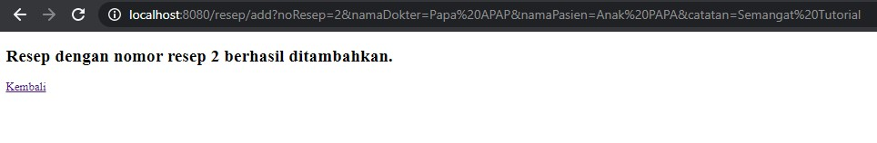
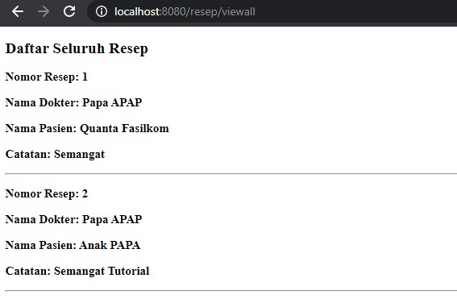

# Tutorial APAP
## Authors
* **Maisy Rahmawati** - *1806147035* - *B*

## Tutorial 1
### What I have learned today
Saya belajar menggunakan IDE Intellij pada tutorial kali ini, karena sebelumnya saya belum pernah
menggunakan Intellij. Saya juga mereview lagi penggunaan git di cmd karena sudah sedikit lupa.
### Github
1. Apa itu Issue Tracker? Apa saja masalah yang dapat diselesaikan dengan Issue Tracker?
 Issue tracker sendiri merupakan salah satu tempat yang disediakan oleh Github dimana pengguna dapat 
 menuliskan berbagai issue (permasalahan), ide, penyempurnaan, bugs software, dan sebagainya.
 Dinamakan issue tracker karena kita dapat melakukan tracking atau pelacakan terkait apa yang kita tulis
 seperti pekerjaan (project), masalah yang kita tulis, bugs, dsb.
 Dengan adanya issue di dalam repository, kita juga dapat memiliki feedback. Dengan adanya Issue Tracker,
 kita juga dapat mentransfer open issue ke repository yang lain. Kita dapat menggunakan "Pin" untuk
 menandai masalah, sehingga ketika kita melakukan tracking maka tidak ada masalah yang terlewat atau duplikat.
 Source: https://docs.github.com/en/github/managing-your-work-on-github/about-issues
2. Apa perbedaan dari git merge dan git merge --squash?
git merge dan git merge --squash sama sama mengintegrasikan (menyatukan) cabang / branch yang berbeda.
Perbedaannya terletak pada commit, dimana pada git merge maka hanya akan muncul merge commit.
Sedangkan pada git merge --squash, merge commit tidak muncul melainkan semua perubahan yang terjadi
di dalam Master akan dijadikan satu dengan commit squash.
3. Apa keunggulan menggunakan Version Control System seperti Git dalam pengembangan suatu
aplikasi?
Version Control System merupakan infrastruktur yang mendukung pengembangan suatu project (aplikasi) secara 
kolaboratif. Dengan adanya fitur kolaborasi, maka suatu project aplikasi dapat dikerjakan secara bersama sesuai
dengan peran masing-masing orang. Maksudnya, orang kedua tidak harus menunggu orang pertama selesai dalam 
mengerjakan tugasnya lebih dulu untuk dapat mengerjakan fitur yang menjadi tanggung jawabnya. Ia dapat mengerjakan
bersamaan dengan fitur branch. Setelah semuanya selesai, mereka dapat mengintegrasikan fitur yang telah mereka
buat dalam masing-masing branch melalui perintah merge ke dalam master.
### Spring
4. Apa itu library & dependency?
Library adalah koleksi modul-modul program yang dapat mendukung dan memudahkan pengembangan software.
Depedency adalah ketergantungan, dalam hal ini adalah atribut yang menentukan nilai atribut lainnya.
5. Mengapa kita menggunakan Maven? Apakah ada alternatif dari Maven?
Maven sendiri merupakan salah satu Build Tools, dimana tujuan dari penggunaan ini (Mavem) adalah sebagai
solusi terkait dengan permasalahan perbedaan penggunaan IDE. Setiap programmer tentukan akan nyaman membuat
suatu project seperti project Java dengan menggunakan IDE yang sudah familiar bagi mereka. Namun, setiap IDE
mempunyai struktur project default masing-masing yang telah mereka tentukan yang umumnya hanya dapat dibaca 
oleh IDE tersebut saja. Oleh karena itu, digunakan Build Tools agar programmer dapat berkerja bersama-sama 
dengan IDE yang berbeda. Maven memiliki keunggulan yaitu struktur project yang dibuat sendiri sehingga dapat
dibuka dengan berbagai IDE. Selain itu, Maven juga memberikan kemudahan dalam memanage dependency.
Alternatif selain maven yang dapat digunakan mungkin nodejs dan npm.
Source: https://medium.com/@acep.abdurohman90/mengenal-maven-sebagai-java-build-tools-5ba752f75812
6. Selain untuk pengembangan web, apa saja yang bisa dikembangkan dengan Spring framework?
Spring Framework bisa digunakan untuk support pada dependency injection, dapat menjadi fondasi untuk framework
lainnya seperti AspectJ, Bean Validation, dan JPA.
7. Apa perbedaan dari @RequestParam dan @PathVariable? Kapan sebaiknya menggunakan
@RequestParam atau @PathVariable?
@RequestParam digunakan untuk mengekstrak parameter query, @PathVariable digunakan untuk mengekstrak data langsung dari URI.
@PathVariable lebih digunakan untuk web RESTful di mana URL berisi nilai, mis. http: // localhost: 8080 
sedangkan @RequestParam digunakan untuk website tradisional.
Source: https://www.javacodegeeks.com/2017/10/differences-requestparam-pathvariable-annotations-spring-mvc.html
### What I did not understand
(tuliskan apa saja yang kurang Anda mengerti, Anda dapat men-_check_ apabila Anda sudah mengerti
dikemudian hari, dan tambahkan tulisan yang membuat Anda mengerti)
- [ ] Kenapa saya harus belajar APAP?
- [ ] Kenapa pakai VSCode susah ngerun?
- [ ] Bagaimana mendeteksi dan mengetahui error di Intellij?
- [ ] Bagaimana mengganti commit message di git?
- [ ] Apa web yang bisa menjadi referensi agar mudah mempelajari penggunaan perintah git di cmd?

## Tutorial 2
### What I have learned today
Pada tutorial ke-dua ini, saya mempelajari konsep tentang MVC dan bagaimana kita mengaplikasikan MVC tersebut.
Selain itu, saya juga belajar untuk lebih memahami konsep dependency injection, walaupun sejujurnya masih terdapat
beberapa konsep yang masih membingungkan.
### Pertanyaan
1. Pertanyaan 1: Cobalah untuk menambahkan sebuah resep dengan mengakses link berikut:
http://localhost:8080/resep/add?noResep=1&namaDokter=Papa%20APAP&namaPasien=Quanta%20Fasilkom&catatan=Semangat
Apa yang terjadi? Jelaskan mengapa hal tersebut dapat terjadi!
Ketika saya mencoba menjalankan akses link tersebut, saya mendapatkan error, di mana link tersebut tidak dapat terakses.
Menurut saya, hal tersebut dikarenakan pada saat kita membuat method public String addResep, di baris terakhir, kita
melakukan return "add-resep". View yang kita return berupa add-resep tersebut belum kita buat HTML-nya (templatenya),
sehingga sungguh mustahil jika kita dapat mengakses link tersebut disaat templatenya belum kita buat.
2. Menurut kamu anotasi @Autowired pada class Controller tersebut merupakan implementasi dari konsep apa? 
Dan jelaskan secara singkat cara kerja @Autowired tersebut dalam konteks service dan controller yang telah kamu buat!
Menurut pendapat saya, anotasi @Autowired merupakan implementasi Dependency Injection.
Sebelum membuat method-method di dalam class ResepController, kita terlebih dahulu menuliskan @Controller. Ini dimaksudkan
untuk Spring Framework melakukan inisiasi terhadap class ResepController. Spring Framework juga akan melakukan injection
(suntikan) terhadap kebergantungan (dependency) class tersebut. Dari pandangan saya, anotasi @Autowired dapat menggantikan
peranan dari method setter atau penambahan argumen pada constructor saat kita akan melakukan injection terhadap dependency.
Ketika kita menggunakan anotasi @Autowired, maka Spring Framework akan melakukan injection dengan objek yang bertipe sama 
untuk dependency yang terjadi pada class tersebut. Pada kasus Controller dan Service yang telah dibuat, di dalam class
ResepController, terdapat objek ResepService yang mana ResepService akan menentukan terbentuknya class ResepController.
Atau kita dapat mengatakan bahwa class ResepController tidak dapat terbentuk tanpa terbentuknya ResepService (ada dependency
antara ResepController dan ResepService). Selanjutnya, kita juga membuat class ResepInMemoryService yang mengimplement 
ResepService. Dengan adanya implements ini, maka class ResepInMemoryService (khususnya method getResepByNomorResep) dapat 
digunakan pada property ResepService di dalam class ResepController. Selanjutnya, anotasi @Autowired pada properti ResepService
digunakan untuk injeksi ResepService yaitu ResepInMemoryService (khususnya method getResepByNomorResep).
3. Cobalah untuk menambahkan sebuah resep dengan mengakses link berikut:
http://localhost:8080/resep/add?noResep=1&namaDokter=Papa%20APAP&namaPasien=Quanta%20Fasilkom 
Apa yang terjadi? Jelaskan mengapa hal tersebut dapat terjadi!
Ketika saya mengakses link tersebut, yang muncul adalah Whitelabel Error Page. Menurut saya, hal ini dapat terjadi karena
tidak ada 'catatan' yang dimasukkan sebagai parameter di dalam link tersebut. Sementara, ketika kita membuat objek ResepModel,
terdapat parameter noResep, namaDokter, namaPasien, catatan yang harus kita masukkan sebagaimana yang telah didefinisikan pada class 
ResepModel yang telah kita buat sebelumnya. Oleh karena itu, ketika kita mengklik link tersebut, kita justru mendapatkan whitelabel 
error page. 
4. Jika Papa APAP ingin melihat resep untuk pasien yang bernama Quanta, link apa yang harus diakses?
http://localhost:8080/resep/view?noResep=1 (pasien Quanta memiliki nomor resep 1, jadi kita harus memasukkan parameter noResep=1)
5. Tambahkan 1 contoh resep lainnya sesukamu. Lalu cobalah untuk mengakses http://localhost:8080/resep/viewall , 
apa yang akan ditampilkan? Sertakan juga bukti screenshotmu!
Tampilan bahwa nomor resep yang kita yang kita masukkan berhasil ditambahkan, setelah masuk ke link resep/viewall, akan ditambilkan
informasi dari apa yang kita telah masukkan.

Setelah kita mengakses http://localhost:8080/resep/viewall

### Latihan
4. 
5. 
6. 
7. 
### What I did not understand
(tuliskan apa saja yang kurang Anda mengerti, Anda dapat men-_check_ apabila Anda sudah mengerti
dikemudian hari, dan tambahkan tulisan yang membuat Anda mengerti)
- [ ] Kenapa saya harus belajar APAP?
- [ ] Kenapa pakai VSCode susah ngerun?
- [ ] Bagaimana mendeteksi dan mengetahui error di Intellij?
- [ ] Bagaimana mengganti commit message di git?
- [ ] Apa web yang bisa menjadi referensi agar mudah mempelajari penggunaan perintah git di cmd?